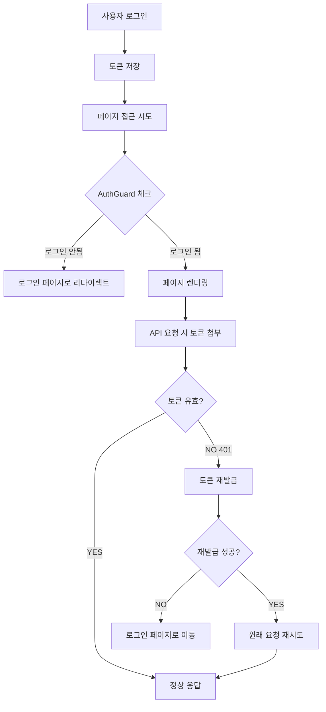

# 로그인 시스템 핵심 로직 5단계

> 복잡해 보이는 로그인 시스템도 결국 5가지 핵심 로직으로 정리됩니다.

## 🎯 핵심 요약

### 1️⃣ 로그인: 토큰 발급 & 저장
**로그인 버튼 → /api/auth/login → Access Token + (HttpOnly Cookie 기반 Refresh Token) + 사용자 정보**

```typescript
// 📍 위치: src/features/auth/hooks/useLogin.ts
const handleLogin = async (credentials: LoginRequest) => {
  const res = await api.post('/api/auth/login', credentials);
  // Access Token & User Info 저장 (Refresh Token은 서버가 HttpOnly Cookie로 내려주므로 JS 접근 불가)
  localStorage.setItem('authToken', res.data.token);
  localStorage.setItem('userInfo', JSON.stringify(res.data.userInfo));
};
```
> Refresh Token은 DB + HttpOnly Cookie로만 관리 → 클라이언트 JS 저장 금지 (보안 + 탈취 위험 감소)

### 2️⃣ 인증: API 요청 시 토큰 자동 첨부
**Axios Request Interceptor가 Access Token을 Authorization 헤더에 자동 설정**

```typescript
// 📍 위치: src/shared/lib/axios.ts (Request Interceptor)
api.interceptors.request.use((config) => {
  const token = localStorage.getItem('authToken');
  
  if (token) {
    config.headers.Authorization = `Bearer ${token}`;
  }
  
  return config;
});
```

### 3️⃣ 갱신: Access Token 만료 시 자동 재발급
**401 + TOKEN_EXPIRED(or 401) → /api/auth/refresh 호출 (쿠키에 있는 Refresh Token 사용) → 새 Access Token 반영**

```typescript
// 📍 위치: src/shared/lib/axios.ts (Response Interceptor)
api.interceptors.response.use(
  (res) => res,
  async (error) => {
    const originalRequest = error.config;
    if (error.response?.status === 401 && !originalRequest._retry) {
      originalRequest._retry = true;
      const newToken = await refreshToken(); // 내부에서 /api/auth/refresh (쿠키 포함) 호출
      if (newToken) {
        originalRequest.headers.Authorization = `Bearer ${newToken}`;
        return api.request(originalRequest);
      }
      // 재발급 실패 → 강제 로그아웃 흐름
      localStorage.removeItem('authToken');
      localStorage.removeItem('userInfo');
      window.location.href = '/login';
    }
    return Promise.reject(error);
  }
);
```

### 4️⃣ 보호: 페이지 접근 & 권한 제어 (AuthGuard)
**로그인 필요/비로그인 전용/역할(Role) 기반 보호. 토큰은 단일 진입점에서만 검사.**

```typescript
// 📍 위치: src/features/auth/components/AuthGuard.tsx
const AuthGuard = ({ children }: { children: React.ReactNode }) => {
  const [isAuthed, setIsAuthed] = useState(false);
  
  useEffect(() => {
    const token = localStorage.getItem('authToken');
    const user = getCurrentUser();
    
    if (!token || !user) {
      router.push('/login');
      return;
    }
    
    setIsAuthed(true);
  }, []);
  
  return isAuthed ? <>{children}</> : <LoadingSpinner />;
};
```

### 5️⃣ 안정성: 동시 재발급(Race) 방지 + Token Rotation + 강제 로그아웃 연계
**401이 여러 요청에서 동시에 발생해도 재발급 한 번만 수행. Rotation 시 이전 Refresh 토큰 DB revoke. 관리자 revoke 시 5분 내 자동 로그아웃.**

```typescript
// 📍 위치: src/features/auth/api/refresh.ts
let refreshPromise: Promise<string | null> | null = null;

export async function refreshToken(): Promise<string | null> {
  if (refreshPromise) return refreshPromise; // 진행 중 재사용
  refreshPromise = api.post('/api/auth/refresh') // 쿠키 포함 자동 전송
    .then(res => {
      const newToken = res.data.token;
      if (newToken) localStorage.setItem('authToken', newToken);
      return newToken ?? null;
    })
    .catch(() => null)
    .finally(() => { refreshPromise = null; });
  return refreshPromise;
}
// Token Rotation은 백엔드에서 이전 refresh revoke + 새 refresh 발급 (DB 레코드 교체)
// 강제 로그아웃: 관리자가 refresh revoke → 재발급 실패 → Access 만료 시 자동 로그아웃 흐름 확정
```

---

## 🔄 전체 플로우



---

## 🌍 범용성: 어떤 백엔드든 동일한 패턴

이 5단계 패턴은 백엔드 기술 스택에 관계없이 거의 동일하게 적용됩니다 (Refresh Token 저장 매체만 다를 수 있음, 여기서는 DB+HttpOnly Cookie):

### 🔥 NestJS + TypeScript
```typescript
// 백엔드 (NestJS)
@Post('/auth/login')
async login(@Body() loginDto: LoginDto) {
  const user = await this.authService.validateUser(loginDto);
  const tokens = await this.authService.generateTokens(user);
  return { token: tokens.accessToken, refreshToken: tokens.refreshToken };
}

// 프론트엔드 (동일한 패턴)
const response = await api.post('/api/auth/login', credentials);
localStorage.setItem('authToken', response.data.token);
```

### 🚀 Golang + Gin
```go
// 백엔드 (Golang)
func Login(c *gin.Context) {
    var loginData LoginRequest
    c.ShouldBindJSON(&loginData)
    
    user := validateUser(loginData)
    token := generateJWT(user)
    
    c.JSON(200, gin.H{"token": token, "refreshToken": refreshToken})
}

// 프론트엔드 (동일한 패턴!)
const response = await api.post('/api/auth/login', credentials);
localStorage.setItem('authToken', response.data.token);
```

### 🐍 Python + FastAPI
```python
# 백엔드 (FastAPI)
@app.post("/auth/login")
async def login(login_data: LoginSchema):
    user = validate_user(login_data)
    token = create_access_token(user)
    return {"token": token, "refresh_token": refresh_token}

# 프론트엔드 (동일한 패턴!)
const response = await api.post('/api/auth/login', credentials);
localStorage.setItem('authToken', response.data.token);
```

### ☕ Java + Spring Boot
```java
// 백엔드 (Spring Boot)
@PostMapping("/auth/login")
public ResponseEntity<?> login(@RequestBody LoginRequest request) {
    User user = authService.authenticate(request);
    String token = jwtUtil.generateToken(user);
    return ResponseEntity.ok(new LoginResponse(token, refreshToken));
}

// 프론트엔드 (동일한 패턴!)
const response = await api.post('/api/auth/login', credentials);
localStorage.setItem('authToken', response.data.token);
```

**핵심**: 백엔드가 JWT 토큰만 표준적으로 발급하면, 프론트엔드는 항상 같은 5단계 패턴으로 처리 가능합니다!

### 🎯 5번째 단계가 중요한 이유

**문제 상황**: 사용자가 여러 탭에서 동시에 API 요청을 했는데 모든 토큰이 만료된 경우
1. 탭 A: `/api/users/me` 요청 → 401 응답 → 토큰 재발급 시작
2. 탭 B: `/api/posts/list` 요청 → 401 응답 → 토큰 재발급 시작  
3. 탭 C: `/api/notifications` 요청 → 401 응답 → 토큰 재발급 시작

**해결**: `refreshPromise` 변수로 진행 중인 재발급 요청을 공유
- 첫 번째 요청만 실제 재발급 API 호출
- 나머지는 같은 Promise 재사용
- 모든 요청이 새 토큰을 받아서 원래 요청 재시도

---

## 💡 핵심 포인트

### ✅ 이렇게 동작합니다
- **자동화**: 토큰 첨부와 갱신이 모두 자동으로 처리됩니다
- **투명성**: 개발자는 토큰 관리를 신경쓰지 않고 API만 호출하면 됩니다
- **견고성**: 토큰 만료를 자동으로 감지하고 처리합니다

### 🔧 주요 구현 파일
- **로그인 로직**: `src/features/auth/hooks/useLogin.ts`
- **토큰 관리**: `src/shared/lib/axios.ts`
- **페이지 보호**: `src/features/auth/components/AuthGuard.tsx`
- **사용자 정보**: `src/entities/user/lib/auth-utils.ts`

---

## 🚀 실제 사용 예시

### 일반적인 API 호출
```typescript
// 개발자는 그냥 API만 호출하면 됩니다
const fetchUserData = async () => {
  const response = await api.get('/api/users/me');
  return response.data;
};

// 토큰 첨부, 만료 처리는 모두 자동으로 됩니다!
```

### 로그인 처리
```typescript
const LoginPage = () => {
  const login = useLogin();
  
  const handleSubmit = (formData) => {
    login.mutate(formData); // 이것만 하면 끝!
  };
  
  return <LoginForm onSubmit={handleSubmit} />;
};
```

---

## 🔍 트러블슈팅

### 자주 묻는 질문

**Q: 토큰이 만료되면 어떻게 되나요?**
A: 자동으로 재발급을 시도하고, 실패하면 로그인 페이지로 이동합니다.

**Q: API 호출할 때마다 토큰을 넣어야 하나요?**
A: 아니요. Axios 인터셉터가 자동으로 처리합니다.

**Q: 새로고침하면 로그인이 풀리나요?**
A: 아니요. 로컬스토리지에 저장되어 유지됩니다.

### 디버깅 팁
```typescript
// 현재 토큰 상태 확인
console.log('Auth Token:', localStorage.getItem('authToken'));
console.log('User Info:', getCurrentUser());

// 토큰 만료 시간 확인
const token = localStorage.getItem('authToken');
if (token) {
  const payload = JSON.parse(atob(token.split('.')[1]));
  console.log('Token expires at:', new Date(payload.exp * 1000));
}
```

---

## 📝 요약

이 5단계가 전부입니다:
1. **로그인** → Access Token + HttpOnly Refresh (DB 기록) 발급 & 저장
2. **인증** → 요청 시 Access Token 자동 첨부
3. **갱신** → 만료 시 쿠키 기반 자동 재발급 (실패 시 로그아웃)
4. **보호** → AuthGuard로 라우트 접근/역할 제어
5. **안정성** → Race 방지 + Rotation + 강제 로그아웃 연계

이 패턴은 **NestJS, Golang, Python, Java** 등 어떤 백엔드와도 동일하게 작동합니다. 
JWT 표준만 지키면 프론트엔드는 항상 이 5단계로 해결됩니다! 🎉

### 💡 특히 5번째가 중요한 이유
- **성능**: 재발급 1회로 중복 네트워크 비용 제거
- **보안**: Rotation + revoke로 탈취/재사용 공격 방지
- **운영**: 관리자 revoke → 프론트 자동 세션 종료 경로 일원화
- **UX**: 여러 탭/동시 요청에서도 매끄러운 흐름 유지
