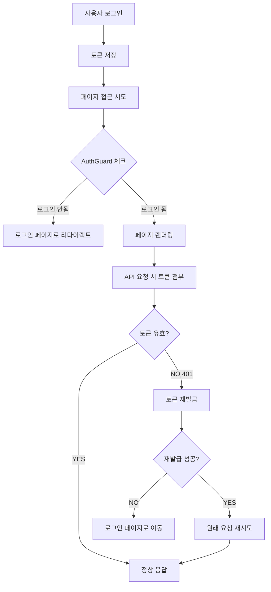

# 로그인 시스템 핵심 로직 5단계

> 복잡해 보이는 로그인 시스템도 결국 5가지 핵심 로직으로 정리됩니다.

## 🎯 핵심 요약

### 1️⃣ 로그인: 토큰 획득하기
**로그인 버튼 클릭 → API 요청 → 백엔드 응답 → 토큰을 로컬스토리지에 저장**

```typescript
// 📍 위치: src/features/auth/hooks/useLogin.ts
const handleLogin = async (credentials: LoginRequest) => {
  const response = await api.post('/api/auth/login', credentials);
  
  // 토큰을 로컬스토리지에 저장
  localStorage.setItem('authToken', response.data.token);
  localStorage.setItem('refreshToken', response.data.refreshToken);
  localStorage.setItem('userInfo', JSON.stringify(response.data.userInfo));
};
```

### 2️⃣ 인증: 토큰 실어 보내기
**API 요청 날릴 때 로그인 사용자 증명용으로 토큰 싣기**

```typescript
// 📍 위치: src/shared/lib/axios.ts (Request Interceptor)
api.interceptors.request.use((config) => {
  const token = localStorage.getItem('authToken');
  
  if (token) {
    config.headers.Authorization = `Bearer ${token}`;
  }
  
  return config;
});
```

### 3️⃣ 갱신: 토큰 만료 시 자동 재발급
**API 응답 받을 때 토큰 만료 응답 있을 시 토큰 재발급 요청**

```typescript
// 📍 위치: src/shared/lib/axios.ts (Response Interceptor)
api.interceptors.response.use(
  (response) => response,
  async (error) => {
    if (error.response?.status === 401 && !originalRequest._retry) {
      originalRequest._retry = true;
      
      // 토큰 재발급 시도
      const newToken = await refreshToken();
      
      if (newToken) {
        originalRequest.headers.Authorization = `Bearer ${newToken}`;
        return api.request(originalRequest);
      }
    }
    
    return Promise.reject(error);
  }
);
```

### 4️⃣ 보호: 페이지 접근 제어
**로그인 상태에 따른 페이지 접근 권한 관리**

```typescript
// 📍 위치: src/features/auth/components/AuthGuard.tsx
const AuthGuard = ({ children }: { children: React.ReactNode }) => {
  const [isAuthed, setIsAuthed] = useState(false);
  
  useEffect(() => {
    const token = localStorage.getItem('authToken');
    const user = getCurrentUser();
    
    if (!token || !user) {
      router.push('/login');
      return;
    }
    
    setIsAuthed(true);
  }, []);
  
  return isAuthed ? <>{children}</> : <LoadingSpinner />;
};
```

### 5️⃣ 중복 방지: 동시 재발급 요청 방지
**여러 API가 동시에 401을 받아도 토큰 재발급 요청은 한 번만 실행**

```typescript
// 📍 위치: src/features/auth/api/refresh.ts
let refreshPromise: Promise<string> | null = null;

export async function refreshToken(): Promise<string> {
  // 이미 재발급 요청이 진행 중이면 그 Promise를 재사용
  if (refreshPromise) {
    console.log("🔄 Reusing existing refresh promise");
    return refreshPromise;
  }

  console.log("🚀 Starting new refresh token request");
  refreshPromise = refreshTokenApi()
    .then((newToken) => {
      localStorage.setItem("authToken", newToken);
      return newToken;
    })
    .finally(() => {
      refreshPromise = null; // 완료되면 초기화
    });

  return refreshPromise;
}
```

---

## 🔄 전체 플로우



---

## 🌍 범용성: 어떤 백엔드든 동일한 패턴

이 4단계 패턴은 백엔드 기술 스택에 관계없이 거의 동일하게 적용됩니다:

### 🔥 NestJS + TypeScript
```typescript
// 백엔드 (NestJS)
@Post('/auth/login')
async login(@Body() loginDto: LoginDto) {
  const user = await this.authService.validateUser(loginDto);
  const tokens = await this.authService.generateTokens(user);
  return { token: tokens.accessToken, refreshToken: tokens.refreshToken };
}

// 프론트엔드 (동일한 패턴)
const response = await api.post('/api/auth/login', credentials);
localStorage.setItem('authToken', response.data.token);
```

### 🚀 Golang + Gin
```go
// 백엔드 (Golang)
func Login(c *gin.Context) {
    var loginData LoginRequest
    c.ShouldBindJSON(&loginData)
    
    user := validateUser(loginData)
    token := generateJWT(user)
    
    c.JSON(200, gin.H{"token": token, "refreshToken": refreshToken})
}

// 프론트엔드 (동일한 패턴!)
const response = await api.post('/api/auth/login', credentials);
localStorage.setItem('authToken', response.data.token);
```

### 🐍 Python + FastAPI
```python
# 백엔드 (FastAPI)
@app.post("/auth/login")
async def login(login_data: LoginSchema):
    user = validate_user(login_data)
    token = create_access_token(user)
    return {"token": token, "refresh_token": refresh_token}

# 프론트엔드 (동일한 패턴!)
const response = await api.post('/api/auth/login', credentials);
localStorage.setItem('authToken', response.data.token);
```

### ☕ Java + Spring Boot
```java
// 백엔드 (Spring Boot)
@PostMapping("/auth/login")
public ResponseEntity<?> login(@RequestBody LoginRequest request) {
    User user = authService.authenticate(request);
    String token = jwtUtil.generateToken(user);
    return ResponseEntity.ok(new LoginResponse(token, refreshToken));
}

// 프론트엔드 (동일한 패턴!)
const response = await api.post('/api/auth/login', credentials);
localStorage.setItem('authToken', response.data.token);
```

**핵심**: 백엔드가 JWT 토큰만 표준적으로 발급하면, 프론트엔드는 항상 같은 5단계 패턴으로 처리 가능합니다!

### 🎯 5번째 단계가 중요한 이유

**문제 상황**: 사용자가 여러 탭에서 동시에 API 요청을 했는데 모든 토큰이 만료된 경우
1. 탭 A: `/api/users/me` 요청 → 401 응답 → 토큰 재발급 시작
2. 탭 B: `/api/posts/list` 요청 → 401 응답 → 토큰 재발급 시작  
3. 탭 C: `/api/notifications` 요청 → 401 응답 → 토큰 재발급 시작

**해결**: `refreshPromise` 변수로 진행 중인 재발급 요청을 공유
- 첫 번째 요청만 실제 재발급 API 호출
- 나머지는 같은 Promise 재사용
- 모든 요청이 새 토큰을 받아서 원래 요청 재시도

---

## 💡 핵심 포인트

### ✅ 이렇게 동작합니다
- **자동화**: 토큰 첨부와 갱신이 모두 자동으로 처리됩니다
- **투명성**: 개발자는 토큰 관리를 신경쓰지 않고 API만 호출하면 됩니다
- **견고성**: 토큰 만료를 자동으로 감지하고 처리합니다

### 🔧 주요 구현 파일
- **로그인 로직**: `src/features/auth/hooks/useLogin.ts`
- **토큰 관리**: `src/shared/lib/axios.ts`
- **페이지 보호**: `src/features/auth/components/AuthGuard.tsx`
- **사용자 정보**: `src/entities/user/lib/auth-utils.ts`

---

## 🚀 실제 사용 예시

### 일반적인 API 호출
```typescript
// 개발자는 그냥 API만 호출하면 됩니다
const fetchUserData = async () => {
  const response = await api.get('/api/users/me');
  return response.data;
};

// 토큰 첨부, 만료 처리는 모두 자동으로 됩니다!
```

### 로그인 처리
```typescript
const LoginPage = () => {
  const login = useLogin();
  
  const handleSubmit = (formData) => {
    login.mutate(formData); // 이것만 하면 끝!
  };
  
  return <LoginForm onSubmit={handleSubmit} />;
};
```

---

## 🔍 트러블슈팅

### 자주 묻는 질문

**Q: 토큰이 만료되면 어떻게 되나요?**
A: 자동으로 재발급을 시도하고, 실패하면 로그인 페이지로 이동합니다.

**Q: API 호출할 때마다 토큰을 넣어야 하나요?**
A: 아니요. Axios 인터셉터가 자동으로 처리합니다.

**Q: 새로고침하면 로그인이 풀리나요?**
A: 아니요. 로컬스토리지에 저장되어 유지됩니다.

### 디버깅 팁
```typescript
// 현재 토큰 상태 확인
console.log('Auth Token:', localStorage.getItem('authToken'));
console.log('User Info:', getCurrentUser());

// 토큰 만료 시간 확인
const token = localStorage.getItem('authToken');
if (token) {
  const payload = JSON.parse(atob(token.split('.')[1]));
  console.log('Token expires at:', new Date(payload.exp * 1000));
}
```

---

## 📝 요약

이 5단계가 전부입니다:
1. **로그인** → 토큰 저장
2. **인증** → API 요청 시 토큰 첨부  
3. **갱신** → 토큰 만료 시 자동 재발급
4. **보호** → 페이지 접근 권한 관리
5. **중복 방지** → 동시 재발급 요청 방지

이 패턴은 **NestJS, Golang, Python, Java** 등 어떤 백엔드와도 동일하게 작동합니다. 
JWT 표준만 지키면 프론트엔드는 항상 이 5단계로 해결됩니다! 🎉

### 💡 특히 5번째가 중요한 이유
- **성능**: 불필요한 중복 API 호출 방지
- **안정성**: 동시 요청 환경에서도 안전한 토큰 관리
- **사용자 경험**: 여러 탭에서 동시 작업 시에도 매끄러운 동작
